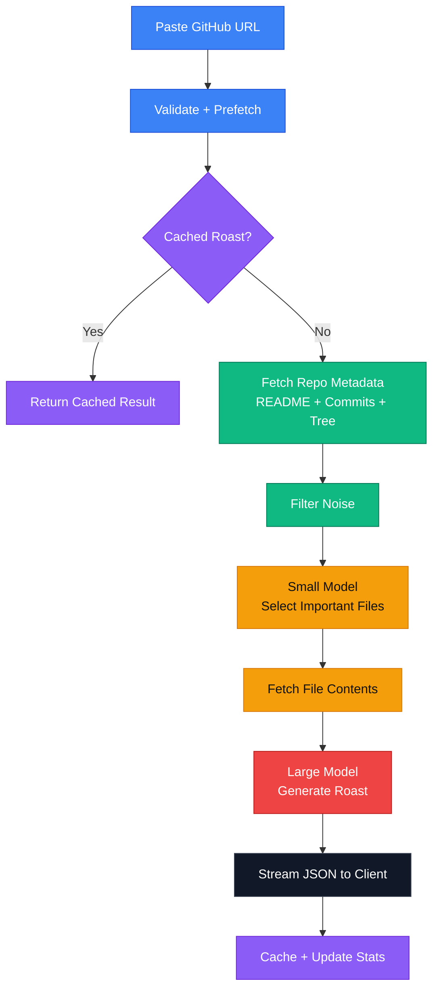

# RepoRoast

I built RepoRoast as a fun little weekend project that takes any public GitHub repository and returns a brutally honest roast. Posted it on Reddit and it blew up which was honestly kind of crazy:

- Reddit Post 1: On r/github but it got removed \:(

- [Reddit Post 2](https://www.reddit.com/r/webdev/comments/1rsyxpp/how_i_got_500_people_to_roast_their_github_repos/?utm_source=share&utm_medium=web3x&utm_name=web3xcss&utm_term=1&utm_content=share_button)

- [Reddit Post 3](https://www.reddit.com/r/coolgithubprojects/comments/1s0scjl/how_i_got_1400_people_to_roast_their_github_repos/?utm_source=share&utm_medium=web3x&utm_name=web3xcss&utm_term=1&utm_content=share_button)

It is built to feel fast, merciless, and a little unhinged on purpose. The project focuses on good UX flow, efficient LLM usage, caching, and a visual style with attention to detail that does not look like vibe coded slop.

## Current Stats

- 2.6k people have used it so far
- 10,000+ website visits
- 15M+ tokens burned so far

## How it works

1. A user pastes a GitHub repo URL.
2. The client prefetches repo data in the background as soon as the URL looks valid.
3. The app checks whether a roast already exists in cache.
4. If not, it fetches repository metadata, README content, commit messages, and a filtered file tree.
5. A smaller model picks the most important files.
6. Those selected files are sent to a larger model that generates the final roast.
7. The roast streams back to the UI as JSON and is cached for later.

## Tech Stack

### Frontend

- Next.js
- TypeScript
- Tailwind CSS
- Radix UI / shadcn components
- lucide-react icons
- facehash for generated avatars

### Backend

- Express
- Mistral AI for LLM calls
- Upstash Redis for caching
- llm-json-validator for streaming JSON parsing

## Architecture

RepoRoast uses a two-stage LLM pipeline so it can stay responsive and avoid sending unnecessary context to the larger model.

The repo tree can be huge, but most files are irrelevant to understanding the project. RepoRoast first uses a smaller fast model to choose the most useful files, then only sends those files plus compact repo metadata to the larger model.

That keeps the prompt smaller, the response faster, and the output more grounded.

## Caching And Performance

RepoRoast uses several layers of caching and prefetching:

- Client-side prefetching warms the repo summary before navigation.
- Server-side roast caching avoids regenerating the same result.
- GitHub repo existence checks are cached briefly in memory.
- Upstash Redis stores the roast cache, total roast count, and recent roasts.
- The file tree pipeline filters noise before asking the smaller model for file selection.

This combination is what makes the app feel fast even though it is doing multiple network calls and two LLM passes.

## API Key Rotation

I do not have enough money to pay for large LLM requests. So what did I do? 

Mistral offeres a fairly generous free tier, so I created multiple accounts and made the server support multiple Mistral API keys through environment variables like `MISTRAL_API_KEY`, `MISTRAL_API_KEY_2`, and so on.

It rotates through them so requests are spread across keys instead of relying on just one. That helps keep the demo usable when one key hits rate limits or token usage for the month.

## Things I Learned Or Found

- How to optimize sending things to an LLM
- Lucide animated icons
- Prefetching repo data + LLM call before the user even presses the roast button making it feel a lot more snappy
- Game of Life in the footer: [credits](https://www.agastyasharma.dev/)
- A nice avatar library: [facehash](https://www.facehash.dev/)
- Prompt engineering
- Being able to stream JSON and parse on the fly

Thank you for reaching this far \:)